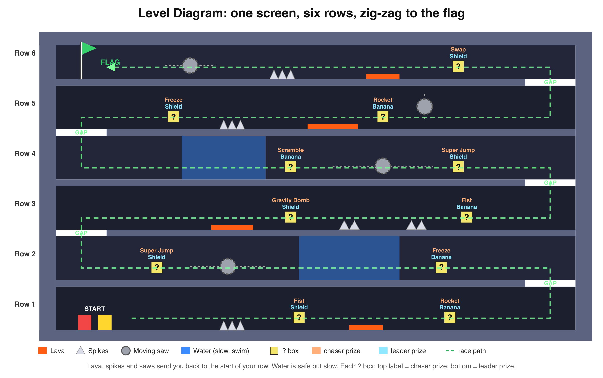

# BONKERS!

**(2D Platformer Race + Place-Based Sabotage)**

A two-player, one-keyboard platform race. Red vs Yellow, one screen, first to the flag wins.
Hidden **?** boxes hand attacks to whoever is behind and only defence to whoever is ahead,
so no lead is ever safe and every race stays neck and neck until the flag.

- **Play in the browser:** https://[username].github.io/bonkers/
- **Gameplay video:** [link]
- **Descriptive document:** [`Documentation/Bonkers_Paired_Prototype_Document.docx`](Documentation/Bonkers_Paired_Prototype_Document.docx)

Made in **Unity 6 (6000.3)**. No external assets: every shape, color and sound is made in code.



## Controls

| Action | Red | Yellow |
|---|---|---|
| Move | A / D | Left / Right |
| Jump (tap again in water to swim) | W | Up |
| Use power-up | S | Down |

**Space** start / rematch · **R** restart the round · **Esc** back to the menu

## How it plays

- Run along a row, then jump up through the gap at the end to reach the next one. Six rows, flag at the top.
- **Lava, spikes, saws**: back to the start of your row. **Water**: slow and floaty.
- Run into your rival to **shove** them. Land on their head to **STOMP** them.
- A progress bar and a **LEADING / CHASING** tag always show who is ahead and by how much.

## The twist: place-based ? boxes

No dice rolls. Every box has two fixed prizes, and you get one based on your place:

- **Chasing (or level):** an attack or catch-up power.
- **Leading:** defence only, a Shield or a Banana.
- Each box works for each player separately (7 s cooldown), so the leader can't take it from you.
- Every attack can be dodged: jump the punches, run from the drop-bomb's warning beam.
- After a BONK you're immune for 1.2 s, so nobody gets stun-locked.

| Power-up | Who gets it | What it does |
|---|---|---|
| Bonk Fist | Chaser | Punch flies forward: BONK + slow |
| Freeze Ray | Chaser | Ice ball: opponent frozen |
| Gravity Bomb | Chaser | Warning beam, then a bomb drops: heavy, tiny jumps |
| Brain Scramble | Chaser | Warning beam, then a bomb drops: left/right flipped |
| Super Jump | Chaser | Jump up through the floors |
| Rocket Shoes | Chaser | Run super fast |
| Swaparoo | Chaser (last row) | Swap places with your opponent |
| Bubble Shield | Leader | Blocks the next attack |
| Banana Peel | Leader | Drop behind you: whoever steps on it spins out |

## Run it locally

1. Unity Hub → **Add** → pick this folder (Unity 6000.3.x).
2. It opens `Assets/Scenes/Main.unity` automatically. Press **Play**.
3. If the scene is missing: menu **Bonkers → Rebuild Main Scene**.

## Build

- **Bonkers → Build Game (WebGL for GitHub Pages)** writes the web build to `docs/`.
- **Bonkers → Build Game (Mac / Windows)** writes to `Builds/` (not committed).

### Hosting on GitHub Pages

1. Push this repo to GitHub, including the `docs/` folder.
2. Repo **Settings → Pages → Build and deployment**: Source = *Deploy from a branch*, Branch = `main`, Folder = `/docs`.
3. After a minute the game is live at `https://<username>.github.io/<repo-name>/`.

## Project structure

```
Assets/
  Scenes/Main.unity          a Camera + GameManager; the level is built by code at Play
  Editor/BonkersSetup.cs     "Bonkers" menu: rebuild scene, build Mac / Windows / WebGL
  Scripts/
    Core/                    GameManager (title, countdown, race, win), CameraRig, Palette,
                             Shapes (makes sprites), Sfx (makes sounds), DevScreenshots (test helper)
    Level/                   LevelBuilder (layout + which prize is in each box), Flag
    Player/                  PlayerController (move, jump, shove, stomp, status effects)
    PowerUps/                PowerUps (what each does), PowerUpBox (place-based prizes),
                             Projectile, DropStrike, Banana
    Hazards/                 Hazard (lava / spikes), Water, Grinder (saws)
    Effects/                 FX (BONK!, floating text, particles, confetti)
    UI/                      Hud (panels, progress bar, title + win screens)
docs/                        WebGL build served by GitHub Pages
Documentation/               descriptive document + diagrams
```

## Changing things

- **Level layout / box prizes:** `LevelBuilder.BuildRowContent()`, e.g. `Box(2, -1.5f, PowerUpType.GravityBomb, PowerUpType.Shield);`
- **New power-up:** add it to `PowerUpType`, give it a name and color, add a `case` in `PowerUps.Use()`, put it in a box.
- **Feel** (speed, jump, gravity): the fields at the top of `PlayerController`.
- **How far ahead counts as leading:** `LeadMargin` in `GameManager`.

## Team

| Name | Contributions |
|---|---|
| Samarth Borade | [fill in] |
| [Teammate 2] | [fill in] |
| [Teammate 3] | [fill in] |
